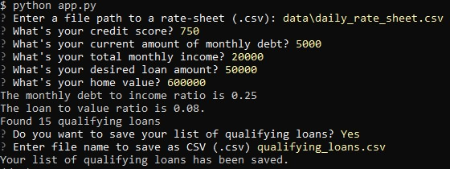
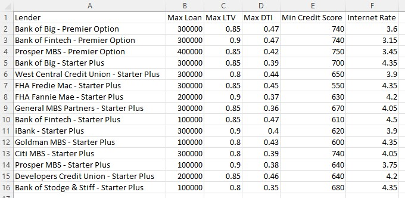

# loan_qualifier_-app

This is an application to determine which loans the user qualifies for. The application runs the user information through loan criteria defined by its lenders found in the 'daily_rate_sheet.csv'. When the user uses the application, they are expected to answer a few questions for eligibility. If eligible, the application will return a list of qualifying loans and it allows for the user to save them to a CSV file so they can share the results as a spreadsheet. 

---

## Technologies

This project uses Python 3.7+ with Fire and Questionary.
+ Fire: tool for creating CLI in Python.
+ Questionary: a Python library for building command line interfaces. 

---

## Installation Guide

Check to ensure that Fire and Questionary are installed on your machine by entering the following into your environment:
```
pip install fire
pip install questionary 
```
---

## Usage

This application can be used by accessing the clone repository and run the app.py in terminal. 

1. When asked to "Enter a file path to a rate-sheet (.csv):", enter the following:
```
./data/daily_rate_sheet.csv
```
2. User will answer the eligibility questions. 
3. The user will be asked if they would like to save the list. 
4. They can enter text to name file, followed by ".csv" to set it as a CSV file. 
 

CSV file example:



---

## Contributors

Leigh Anne Badua

---

## License

+ [GNU General Public License v3.0](https://choosealicense.com/licenses/gpl-3.0/)
